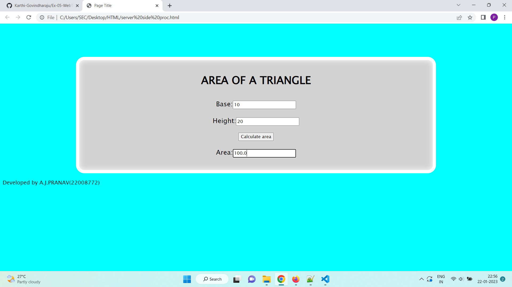

# Design a Website for Server Side Processing

# AIM:

To design a website to perform mathematical calculations in server side.

# DESIGN STEPS:

## Step 1:


## Step 2:


## Step 3:


## Step 4:


## Step 5:


# PROGRAM:
``` html
index.html
<html>
<head>
    <meta charset='utf-8'>
    <meta http-equiv='X-UA-Compatible' csontent='IE=edge'>
    <title>Page Title</title>
    <meta name='viewport' content='width=device-width, initial-scale=1'>
    
</head>
<style>
    *{
        box-sizing: border-box;
        font-family:'Lucida Sans', 'Lucida Sans Regular', 'Lucida Grande', 'Lucida Sans Unicode',
		Geneva, Verdana, sans-serif
    }
	
	body{
	background-color:cyan
	}

    .container{
    width: 1080px;
    height: 350px;
    margin-top: 100px;
    margin-left: auto;
    margin-right: auto;
    border-radius: 25px;
    border: 10px solid rgb(255, 255, 255);
    box-shadow: inset 0 0 15px rgb(255, 255, 255);
    background-color:lightgrey;
    }
    h1{
        text-align: center;
        text-emphasis-color: red;
        padding-top: 15px;
    }
    .calculate{
        padding-top: 10px;
        padding-bottom: 10px;
        padding-left: 10px;
        padding-right:10px;
        text-align: center;
        font-size: 20px;
    }
</style>
<body>
    <div class="container">
        <h1>AREA OF A TRIANGLE</h1>
        <form method="POST">
            <div class="calculate"> 
                Base:<input type="text" name="base" value={{b}}></input><br/>
            </div>
            <div class="calculate">
                Height:<input type="text" name="height" value={{h}}></input><br/>
            </div>
            <div class="calculate">
                <input type="submit" value="Calculate area"></input><br/>
            </div>
            <div class="calculate">
                Area:<input type="text" name="area" value={{area}}></input>
            </div>
        </form>
    </div>
     <p>Developed by A.J.PRANAV(22008772)</p>
</body>
</html>
```
```python
views.py :

from django.shortcuts import render
def areacalculation(request): 
    context ={} 
    context["area"]='0' 
    context["b"]='0' 
    context["h"]='0' 
    if request.method == 'POST':
        b=request.POST.get('base','0')
        h=request.POST.get('height','0')
        area=0.5*int(b)*int(h)
        context['area'] = area
        context['b']=b
        context['h']=h
    return render(request,"aldrinapp/math.html",context)

    url.py :

from django.contrib import admin
from django.urls import path
from aldrinapp import views

urlpatterns = [
    path('admin/', admin.site.urls),
    path('areaoftriangle/',views.areacalculation,name="areaoftriangle"),
    path('',views.areacalculation,name="areaoftriangleroot")
]
```
# OUTPUT:

# RESULT:

The program is executed succesfully
